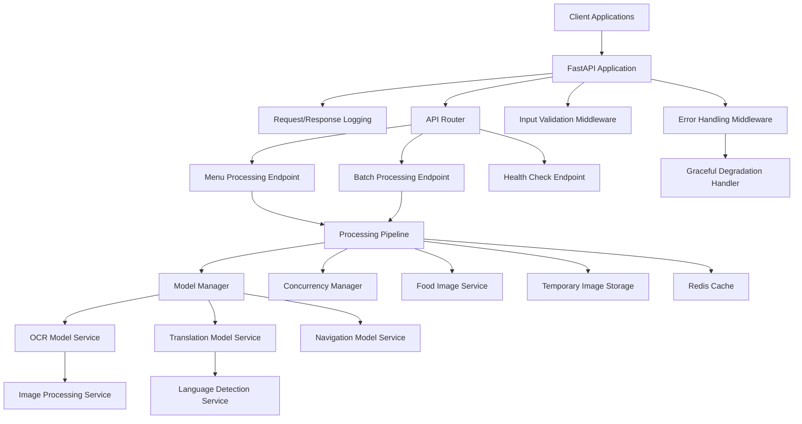

# Design Document

## Overview

The Menu Translation Backend is a FastAPI-based microservice that provides intelligent menu translation capabilities through a pluggable AI model architecture. The system accepts menu images, processes them through OCR to extract text, translates the content to target languages, and retrieves corresponding food images. The architecture emphasizes modularity, scalability, and maintainability through dependency injection and clean separation of concerns.

## Architecture

### High-Level Architecture



### Core Components

1. **FastAPI Application Layer**: Main application with comprehensive middleware stack for logging, error handling, and validation
2. **Model Manager**: Central registry and lifecycle management for AI models with hot-swapping capabilities
3. **Processing Pipeline**: Orchestrates the complete menu processing workflow from image to translated results
4. **Concurrency Manager**: Handles concurrent request processing with proper resource management and queuing
5. **Service Layer**: Business logic for OCR, translation, language detection, and food image retrieval
6. **Storage Layer**: Temporary file storage, caching mechanisms, and automatic cleanup
7. **API Layer**: RESTful endpoints with standardized responses and comprehensive error handling

### Design Rationale

- **Pluggable Architecture**: The Model Manager allows easy integration and hot-swapping of different AI models without system restart, addressing Requirement 1
- **Processing Pipeline**: Centralizes the workflow to ensure consistent processing and easier maintenance
- **Concurrency Management**: Dedicated component to handle multiple simultaneous requests efficiently (Requirement 7)
- **Comprehensive Error Handling**: Multi-layered error handling with graceful degradation ensures system availability (Requirement 6)
- **Standardized Responses**: Consistent API response format across all endpoints (Requirement 8)

## Components and Interfaces

### Model Manager Interface

The Model Manager provides a pluggable architecture for AI models with hot-swapping capabilities:

```python
from abc import ABC, abstractmethod
from typing import Any, Dict, Optional, List
from enum import Enum
import asyncio
import logging

class ModelType(Enum):
    OCR = "ocr"
    TRANSLATION = "translation"
    NAVIGATION = "navigation"

class ModelStatus(Enum):
    INITIALIZING = "initializing"
    READY = "ready"
    FAILED = "failed"
    SWAPPING = "swapping"

class BaseModel(ABC):
    def __init__(self):
        self.status = ModelStatus.INITIALIZING
        self.last_error: Optional[str] = None
    
    @abstractmethod
    async def initialize(self) -> bool:
        """Initialize the model and return success status"""
        pass
    
    @abstractmethod
    async def process(self, input_data: Any) -> Dict[str, Any]:
        """Process input and return results"""
        pass
    
    @abstractmethod
    async def health_check(self) -> bool:
        """Check if model is healthy and ready"""
        pass
    
    @abstractmethod
    async def cleanup(self) -> None:
        """Clean up model resources"""
        pass

class ModelManager:
    def __init__(self):
        self._models: Dict[ModelType, BaseModel] = {}
        self._model_locks: Dict[ModelType, asyncio.Lock] = {}
        self._logger = logging.getLogger(__name__)
    
    async def register_model(self, model_type: ModelType, model: BaseModel) -> bool:
        """Register a model with the manager (Requirement 1.2)"""
        pass
    
    async def get_model(self, model_type: ModelType) -> Optional[BaseModel]:
        """Retrieve a registered model (Requirement 1.2)"""
        pass
    
    async def hot_swap_model(self, model_type: ModelType, new_model: BaseModel) -> bool:
        """Replace an existing model without downtime (Requirement 1.3)"""
        pass
    
    async def get_model_status(self, model_type: ModelType) -> ModelStatus:
        """Get current status of a model"""
        pass
    
    async def handle_model_failure(self, model_type: ModelType, error: Exception) -> None:
        """Handle model failures with proper logging (Requirement 1.4)"""
        pass
```

### OCR Service Interface

```python
from PIL import Image
from typing import List, Dict, Tuple, Optional
from dataclasses import dataclass

@dataclass
class OCRResult:
    text: str
    confidence: float
    bbox: Tuple[int, int, int, int]  # (x1, y1, x2, y2)
    group_id: Optional[str] = None  # For spatial grouping of menu items

class ImageValidationError(Exception):
    """Raised when image validation fails"""
    pass

class OCRService:
    SUPPORTED_FORMATS = {'JPEG', 'PNG', 'WEBP'}
    MAX_IMAGE_SIZE = 10 * 1024 * 1024  # 10MB
    MIN_CONFIDENCE_THRESHOLD = 0.3
    
    async def extract_text(self, image: Image.Image) -> List[OCRResult]:
        """Extract text from image with confidence scores and spatial layout (Requirement 3.1, 3.2)"""
        pass
    
    async def preprocess_image(self, image: Image.Image) -> Image.Image:
        """Preprocess image for better OCR results"""
        pass
    
    async def validate_image(self, image_data: bytes) -> Image.Image:
        """Validate image format and size (Requirement 2.1, 2.2, 2.4)"""
        pass
    
    async def process_batch_images(self, images: List[Image.Image]) -> List[List[OCRResult]]:
        """Process multiple images in batch (Requirement 2.3)"""
        pass
    
    def filter_low_confidence_results(self, results: List[OCRResult]) -> List[OCRResult]:
        """Filter results based on confidence threshold (Requirement 3.3)"""
        pass
    
    def group_menu_items(self, results: List[OCRResult]) -> Dict[str, List[OCRResult]]:
        """Group OCR results by spatial proximity for menu item organization (Requirement 3.2)"""
        pass
```

### Translation Service Interface

```python
from typing import List, Optional, Union
from dataclasses import dataclass
from enum import Enum

class SupportedLanguage(str, Enum):
    ENGLISH = "en"
    SPANISH = "es"
    FRENCH = "fr"
    GERMAN = "de"
    ITALIAN = "it"
    PORTUGUESE = "pt"
    CHINESE = "zh"
    JAPANESE = "ja"
    KOREAN = "ko"

@dataclass
class TranslationResult:
    translated_text: str
    source_language: str
    confidence: float
    error_indicator: Optional[str] = None

class UnsupportedLanguageError(Exception):
    """Raised when target language is not supported"""
    pass

class TranslationFailureError(Exception):
    """Raised when translation fails"""
    pass

class TranslationService:
    async def translate_text(
        self, 
        text: str, 
        target_language: SupportedLanguage, 
        source_language: Optional[SupportedLanguage] = None
    ) -> TranslationResult:
        """Translate text to target language (Requirement 4.1)"""
        pass
    
    async def detect_language(self, text: str) -> SupportedLanguage:
        """Detect the language of input text (Requirement 4.2)"""
        pass
    
    async def batch_translate(
        self, 
        texts: List[str], 
        target_language: SupportedLanguage, 
        source_language: Optional[SupportedLanguage] = None
    ) -> List[TranslationResult]:
        """Translate multiple texts in batch"""
        pass
    
    async def validate_language_support(self, language: str) -> bool:
        """Check if language is supported (Requirement 4.4)"""
        pass
    
    async def handle_translation_failure(self, text: str, error: Exception) -> TranslationResult:
        """Handle translation failures gracefully (Requirement 4.3)"""
        pass
```

### Food Image Service Interface

```python
from typing import List, Optional
from dataclasses import dataclass

@dataclass
class FoodImage:
    url: str
    description: str
    relevance_score: float
    is_placeholder: bool = False

class FoodImageService:
    DEFAULT_PLACEHOLDER_URL = "/static/images/food-placeholder.jpg"
    
    async def search_food_images(
        self, 
        food_name: str, 
        limit: int = 5
    ) -> List[FoodImage]:
        """Search for food images by name (Requirement 5.1)"""
        pass
    
    async def get_most_relevant_images(
        self, 
        food_name: str, 
        limit: int = 3
    ) -> List[FoodImage]:
        """Get most relevant images for food item (Requirement 5.2)"""
        pass
    
    async def get_cached_images(self, food_name: str) -> Optional[List[FoodImage]]:
        """Retrieve cached food images"""
        pass
    
    async def cache_images(self, food_name: str, images: List[FoodImage]) -> bool:
        """Cache food images for future use"""
        pass
    
    async def handle_no_images_found(self, food_name: str) -> List[FoodImage]:
        """Return placeholder when no images found (Requirement 5.3)"""
        pass
    
    async def handle_image_service_failure(self, food_name: str) -> List[FoodImage]:
        """Handle image service failures gracefully (Requirement 5.4)"""
        pass

### Concurrency Manager Interface

```python
import asyncio
from typing import Callable, Any, Optional
from dataclasses import dataclass

@dataclass
class QueuedRequest:
    request_id: str
    processing_func: Callable
    args: tuple
    kwargs: dict
    priority: int = 0
    queued_at: datetime = field(default_factory=datetime.utcnow)

class ConcurrencyManager:
    """Manages concurrent request processing (Requirement 7)"""
    
    def __init__(self, config: ConcurrencyConfig):
        self.config = config
        self.active_requests: Dict[str, asyncio.Task] = {}
        self.request_queue: asyncio.Queue = asyncio.Queue()
        self.semaphore = asyncio.Semaphore(config.max_concurrent_requests)
        self.memory_monitor = MemoryMonitor(config.memory_limit_mb)
    
    async def process_request(
        self, 
        request_id: str, 
        processing_func: Callable, 
        *args, 
        **kwargs
    ) -> Any:
        """Process request with concurrency control (Requirement 7.1)"""
        pass
    
    async def queue_request(self, request: QueuedRequest) -> None:
        """Queue request when resources are limited (Requirement 7.2)"""
        pass
    
    async def handle_timeout(self, request_id: str) -> None:
        """Handle processing timeouts (Requirement 7.3)"""
        pass
    
    async def cleanup_resources(self, request_id: str) -> None:
        """Clean up resources after processing (Requirement 7.4)"""
        pass
    
    def get_active_request_count(self) -> int:
        """Get number of currently active requests"""
        return len(self.active_requests)

### Processing Pipeline Interface

```python
class ProcessingPipeline:
    """Orchestrates the complete menu processing workflow"""
    
    def __init__(
        self, 
        model_manager: ModelManager,
        concurrency_manager: ConcurrencyManager,
        food_image_service: FoodImageService
    ):
        self.model_manager = model_manager
        self.concurrency_manager = concurrency_manager
        self.food_image_service = food_image_service
        self.logger = logging.getLogger(__name__)
    
    async def process_menu_image(
        self, 
        image_data: bytes, 
        request: MenuProcessingRequest
    ) -> MenuProcessingResponse:
        """Complete pipeline for processing a single menu image"""
        pass
    
    async def process_batch_images(
        self, 
        batch_request: BatchProcessingRequest
    ) -> BatchProcessingResponse:
        """Process multiple images in batch (Requirement 2.3)"""
        pass
    
    async def handle_processing_failure(
        self, 
        context: ProcessingContext, 
        stage: str, 
        error: Exception
    ) -> None:
        """Handle failures with graceful degradation (Requirement 6.3)"""
        pass
```

## Data Models

### Request/Response Models

```python
from pydantic import BaseModel, Field, validator
from typing import List, Optional, Dict, Any
from enum import Enum
import uuid
from datetime import datetime

class SupportedLanguage(str, Enum):
    ENGLISH = "en"
    SPANISH = "es"
    FRENCH = "fr"
    GERMAN = "de"
    ITALIAN = "it"
    PORTUGUESE = "pt"
    CHINESE = "zh"
    JAPANESE = "ja"
    KOREAN = "ko"

class MenuProcessingRequest(BaseModel):
    target_language: SupportedLanguage
    source_language: Optional[SupportedLanguage] = None
    include_images: bool = Field(default=True)
    max_images_per_item: int = Field(default=3, ge=1, le=10)
    
    @validator('target_language')
    def validate_target_language(cls, v):
        """Validate target language is supported (Requirement 4.4)"""
        if v not in SupportedLanguage:
            raise ValueError(f"Unsupported target language: {v}")
        return v

class ExtractedMenuItem(BaseModel):
    original_text: str
    translated_text: str
    confidence_score: float
    bounding_box: List[int] = Field(description="[x1, y1, x2, y2]")
    food_images: List[str] = Field(default_factory=list)
    processing_status: str = Field(default="success")  # success, partial, failed
    error_details: Optional[str] = None

class MenuProcessingResponse(BaseModel):
    request_id: str
    processing_time_ms: int
    source_language_detected: str
    menu_items: List[ExtractedMenuItem]
    total_items_found: int
    success: bool
    partial_results: bool = Field(default=False)  # Indicates if some items failed (Requirement 8.4)
    error_message: Optional[str] = None
    timestamp: datetime = Field(default_factory=datetime.utcnow)

class BatchProcessingRequest(BaseModel):
    requests: List[MenuProcessingRequest] = Field(max_items=10)
    
class BatchProcessingResponse(BaseModel):
    batch_id: str
    results: List[MenuProcessingResponse]
    total_processed: int
    total_successful: int
    processing_time_ms: int

class HealthCheckResponse(BaseModel):
    status: str
    models_status: Dict[str, bool]
    uptime_seconds: int
    version: str
    concurrent_requests: int
    memory_usage_mb: float

class StandardErrorResponse(BaseModel):
    """Standardized error response format (Requirement 8.3)"""
    error_code: str
    message: str
    details: Optional[Dict[str, Any]] = None
    request_id: str
    timestamp: datetime = Field(default_factory=datetime.utcnow)
```

### Internal Data Models

```python
from dataclasses import dataclass, field
from typing import Dict, List, Optional, Any
import asyncio
from datetime import datetime

@dataclass
class ProcessingContext:
    request_id: str
    start_time: float
    ocr_results: List[OCRResult] = field(default_factory=list)
    translation_results: List[TranslationResult] = field(default_factory=list)
    food_images: Dict[str, List[FoodImage]] = field(default_factory=dict)
    errors: List[str] = field(default_factory=list)
    partial_failures: List[str] = field(default_factory=list)
    processing_stage: str = "initialized"
    
    def add_error(self, stage: str, error: str) -> None:
        """Add error with stage information for debugging (Requirement 6.1)"""
        self.errors.append(f"{stage}: {error}")
    
    def add_partial_failure(self, item: str, reason: str) -> None:
        """Track partial failures for graceful degradation (Requirement 6.3)"""
        self.partial_failures.append(f"{item}: {reason}")

@dataclass
class ModelConfig:
    model_type: ModelType
    config_path: str
    weights_path: Optional[str] = None
    initialized: bool = False
    last_health_check: Optional[datetime] = None
    failure_count: int = 0
    max_failures: int = 3

@dataclass
class ConcurrencyConfig:
    """Configuration for concurrent request handling (Requirement 7)"""
    max_concurrent_requests: int = 10
    queue_timeout_seconds: int = 30
    processing_timeout_seconds: int = 120
    memory_limit_mb: int = 1024

@dataclass
class RequestMetrics:
    """Metrics for monitoring and logging (Requirement 6.2)"""
    request_id: str
    start_time: datetime
    end_time: Optional[datetime] = None
    processing_time_ms: Optional[int] = None
    memory_used_mb: float = 0.0
    models_used: List[str] = field(default_factory=list)
    errors_encountered: List[str] = field(default_factory=list)
```

## Error Handling

### Error Categories and Responses

```python
from fastapi import HTTPException, Request
from fastapi.responses import JSONResponse
from enum import Enum
import logging
import traceback

class ErrorCode(str, Enum):
    INVALID_IMAGE_FORMAT = "INVALID_IMAGE_FORMAT"
    IMAGE_TOO_LARGE = "IMAGE_TOO_LARGE"
    IMAGE_CORRUPTED = "IMAGE_CORRUPTED"
    OCR_PROCESSING_FAILED = "OCR_PROCESSING_FAILED"
    TRANSLATION_FAILED = "TRANSLATION_FAILED"
    MODEL_UNAVAILABLE = "MODEL_UNAVAILABLE"
    UNSUPPORTED_LANGUAGE = "UNSUPPORTED_LANGUAGE"
    PROCESSING_TIMEOUT = "PROCESSING_TIMEOUT"
    MEMORY_LIMIT_EXCEEDED = "MEMORY_LIMIT_EXCEEDED"
    CONCURRENT_LIMIT_EXCEEDED = "CONCURRENT_LIMIT_EXCEEDED"
    INTERNAL_SERVER_ERROR = "INTERNAL_SERVER_ERROR"

class APIError(BaseModel):
    error_code: ErrorCode
    message: str
    details: Optional[Dict[str, Any]] = None
    request_id: str
    timestamp: datetime = Field(default_factory=datetime.utcnow)

class ErrorHandler:
    """Comprehensive error handling with logging (Requirement 6)"""
    
    def __init__(self):
        self.logger = logging.getLogger(__name__)
    
    async def handle_exception(self, request: Request, exc: Exception) -> JSONResponse:
        """Main error handler with detailed logging (Requirement 6.1, 6.2)"""
        request_id = getattr(request.state, 'request_id', str(uuid.uuid4()))
        
        # Log error with full context
        self.logger.error(
            f"Request {request_id} failed: {str(exc)}",
            extra={
                'request_id': request_id,
                'exception_type': type(exc).__name__,
                'traceback': traceback.format_exc(),
                'request_path': request.url.path,
                'request_method': request.method
            }
        )
        
        if isinstance(exc, ImageValidationError):
            return self._create_error_response(
                ErrorCode.INVALID_IMAGE_FORMAT, str(exc), request_id, 400
            )
        elif isinstance(exc, UnsupportedLanguageError):
            return self._create_error_response(
                ErrorCode.UNSUPPORTED_LANGUAGE, str(exc), request_id, 400
            )
        elif isinstance(exc, asyncio.TimeoutError):
            return self._create_error_response(
                ErrorCode.PROCESSING_TIMEOUT, "Request processing timed out", request_id, 408
            )
        else:
            return self._create_error_response(
                ErrorCode.INTERNAL_SERVER_ERROR, "Internal server error", request_id, 500
            )
    
    def _create_error_response(
        self, 
        error_code: ErrorCode, 
        message: str, 
        request_id: str, 
        status_code: int
    ) -> JSONResponse:
        """Create standardized error response (Requirement 8.3)"""
        return JSONResponse(
            status_code=status_code,
            content=StandardErrorResponse(
                error_code=error_code.value,
                message=message,
                request_id=request_id
            ).dict()
        )

# Request/Response logging middleware
class LoggingMiddleware:
    """Comprehensive request/response logging (Requirement 6.2)"""
    
    def __init__(self):
        self.logger = logging.getLogger("api_requests")
    
    async def __call__(self, request: Request, call_next):
        request_id = str(uuid.uuid4())
        request.state.request_id = request_id
        
        start_time = time.time()
        
        # Log request
        self.logger.info(
            f"Request {request_id} started",
            extra={
                'request_id': request_id,
                'method': request.method,
                'path': request.url.path,
                'client_ip': request.client.host,
                'user_agent': request.headers.get('user-agent')
            }
        )
        
        response = await call_next(request)
        
        processing_time = (time.time() - start_time) * 1000
        
        # Log response
        self.logger.info(
            f"Request {request_id} completed",
            extra={
                'request_id': request_id,
                'status_code': response.status_code,
                'processing_time_ms': processing_time
            }
        )
        
        return response
```

### Graceful Degradation Strategy

The system implements comprehensive graceful degradation to maintain service availability (Requirement 6.3):

1. **Model Failures**:
   - **OCR Model Failure**: Return error response but maintain system availability for other requests
   - **Translation Model Failure**: Return extracted text with error indicator, skip translation
   - **Food Image Service Failure**: Return translated text without images, include service unavailable notice

2. **Partial Processing Failures**:
   - **Some Menu Items Fail**: Return successful items with partial_results flag set to true
   - **Low Confidence OCR**: Include items with confidence scores, let client decide filtering
   - **Translation Timeout**: Return original text with timeout indicator

3. **Resource Limitations**:
   - **Memory Pressure**: Queue requests and process sequentially
   - **Concurrent Limit**: Return 429 status with retry-after header
   - **Processing Timeout**: Cancel operation and return partial results if available

4. **Critical System Failures**:
   - **Database Unavailable**: Use in-memory caching, disable image features temporarily
   - **Cache Failure**: Continue processing without caching, log degraded performance
   - **Multiple Model Failures**: Return service degraded status, maintain health endpoint availability

## Testing Strategy

### Unit Testing Approach

```python
# Test structure aligned with requirements
class TestImageValidation:
    """Test image validation requirements (Requirement 2)"""
    
    async def test_supported_image_formats(self):
        """Test JPEG, PNG, WebP format acceptance (Requirement 2.1)"""
        pass
    
    async def test_image_size_limits(self):
        """Test image size limit enforcement (Requirement 2.2)"""
        pass
    
    async def test_batch_image_processing(self):
        """Test multiple image submission (Requirement 2.3)"""
        pass
    
    async def test_corrupted_image_handling(self):
        """Test corrupted image rejection (Requirement 2.4)"""
        pass

class TestOCRService:
    """Test OCR functionality requirements (Requirement 3)"""
    
    async def test_text_extraction_with_confidence(self):
        """Test text extraction with confidence scores (Requirement 3.1)"""
        pass
    
    async def test_spatial_layout_preservation(self):
        """Test menu item grouping and layout (Requirement 3.2)"""
        pass
    
    async def test_low_confidence_filtering(self):
        """Test confidence threshold handling (Requirement 3.3)"""
        pass
    
    async def test_no_text_detection(self):
        """Test empty result handling (Requirement 3.4)"""
        pass

class TestTranslationService:
    """Test translation functionality requirements (Requirement 4)"""
    
    async def test_target_language_translation(self):
        """Test translation to specified language (Requirement 4.1)"""
        pass
    
    async def test_automatic_language_detection(self):
        """Test source language auto-detection (Requirement 4.2)"""
        pass
    
    async def test_translation_failure_handling(self):
        """Test graceful translation failure (Requirement 4.3)"""
        pass
    
    async def test_unsupported_language_error(self):
        """Test unsupported language rejection (Requirement 4.4)"""
        pass

class TestFoodImageService:
    """Test food image functionality requirements (Requirement 5)"""
    
    async def test_food_image_search(self):
        """Test food image retrieval (Requirement 5.1)"""
        pass
    
    async def test_relevant_image_selection(self):
        """Test most relevant image selection (Requirement 5.2)"""
        pass
    
    async def test_no_images_placeholder(self):
        """Test placeholder when no images found (Requirement 5.3)"""
        pass
    
    async def test_image_service_failure_handling(self):
        """Test graceful image service failure (Requirement 5.4)"""
        pass

class TestModelManager:
    """Test pluggable model architecture (Requirement 1)"""
    
    async def test_model_registration(self):
        """Test model registration (Requirement 1.2)"""
        pass
    
    async def test_hot_swap_functionality(self):
        """Test model hot-swapping (Requirement 1.3)"""
        pass
    
    async def test_model_failure_handling(self):
        """Test model failure logging and continuation (Requirement 1.4)"""
        pass

class TestErrorHandling:
    """Test error handling and logging (Requirement 6)"""
    
    async def test_error_logging(self):
        """Test comprehensive error logging (Requirement 6.1)"""
        pass
    
    async def test_request_response_logging(self):
        """Test request/response logging (Requirement 6.2)"""
        pass
    
    async def test_graceful_degradation(self):
        """Test graceful degradation scenarios (Requirement 6.3)"""
        pass
    
    async def test_service_availability_maintenance(self):
        """Test service availability during failures (Requirement 6.4)"""
        pass

class TestConcurrency:
    """Test concurrent request handling (Requirement 7)"""
    
    async def test_concurrent_processing(self):
        """Test simultaneous request processing (Requirement 7.1)"""
        pass
    
    async def test_resource_queuing(self):
        """Test request queuing under load (Requirement 7.2)"""
        pass
    
    async def test_timeout_handling(self):
        """Test processing timeout management (Requirement 7.3)"""
        pass
    
    async def test_resource_cleanup(self):
        """Test proper resource cleanup (Requirement 7.4)"""
        pass

class TestAPIResponses:
    """Test standardized API responses (Requirement 8)"""
    
    async def test_consistent_response_format(self):
        """Test consistent JSON response format (Requirement 8.1)"""
        pass
    
    async def test_successful_response_data(self):
        """Test complete data in successful responses (Requirement 8.2)"""
        pass
    
    async def test_structured_error_responses(self):
        """Test structured error information (Requirement 8.3)"""
        pass
    
    async def test_partial_result_indication(self):
        """Test partial result indicators (Requirement 8.4)"""
        pass
```

### Integration Testing

```python
class TestMenuProcessingPipeline:
    """End-to-end pipeline testing"""
    
    async def test_complete_menu_processing_flow(self):
        """Test full pipeline from image upload to translated results"""
        pass
    
    async def test_batch_processing_workflow(self):
        """Test batch processing functionality"""
        pass
    
    async def test_concurrent_request_handling(self):
        """Test system behavior under concurrent load (Requirement 7.1)"""
        pass
    
    async def test_error_recovery_scenarios(self):
        """Test system recovery from various error conditions (Requirement 6.3)"""
        pass
    
    async def test_partial_failure_scenarios(self):
        """Test handling of partial processing failures (Requirement 8.4)"""
        pass

class TestSystemResilience:
    """Test system resilience and degradation"""
    
    async def test_model_failure_recovery(self):
        """Test system behavior when models fail"""
        pass
    
    async def test_resource_exhaustion_handling(self):
        """Test behavior under resource pressure"""
        pass
    
    async def test_network_failure_resilience(self):
        """Test handling of external service failures"""
        pass
```

### Performance Testing Considerations

1. **Concurrent Load Testing**: Simulate multiple simultaneous requests (Requirement 7.1)
2. **Memory Usage Monitoring**: Track memory consumption and cleanup (Requirement 7.4)
3. **Processing Timeout Validation**: Ensure timeout mechanisms work correctly (Requirement 7.3)
4. **Queue Performance**: Test request queuing under resource constraints (Requirement 7.2)
5. **Model Performance**: Benchmark individual model inference times
6. **Cache Effectiveness**: Measure cache hit rates and performance improvements
7. **Error Recovery Time**: Measure system recovery time from failures (Requirement 6.3)

## Security Considerations

### Input Validation
- Image format validation and sanitization
- File size limits and virus scanning
- Request rate limiting per client
- Input parameter validation using Pydantic

### Authentication & Authorization
- API key-based authentication for service access
- Role-based access control for administrative endpoints
- Request logging and audit trails

### Data Protection
- Temporary image storage with automatic cleanup
- No persistent storage of user-uploaded images
- Encrypted communication (HTTPS/TLS)
- Sanitized error messages to prevent information leakage

## Deployment Architecture

### Container Strategy
```dockerfile
# Multi-stage build for optimized image size
FROM python:3.11-slim as base
# Install system dependencies for image processing
RUN apt-get update && apt-get install -y \
    libgl1-mesa-glx \
    libglib2.0-0 \
    libsm6 \
    libxext6 \
    libxrender-dev \
    libgomp1 \
    && rm -rf /var/lib/apt/lists/*

FROM base as dependencies
COPY requirements.txt .
RUN pip install --no-cache-dir -r requirements.txt

FROM dependencies as application
COPY . /app
WORKDIR /app
EXPOSE 8000
CMD ["uvicorn", "main:app", "--host", "0.0.0.0", "--port", "8000"]
```

### Scalability Considerations
- Horizontal scaling with load balancer
- Model serving on separate GPU-enabled instances
- Redis cluster for distributed caching
- Asynchronous processing for heavy workloads
- Health checks and auto-recovery mechanisms